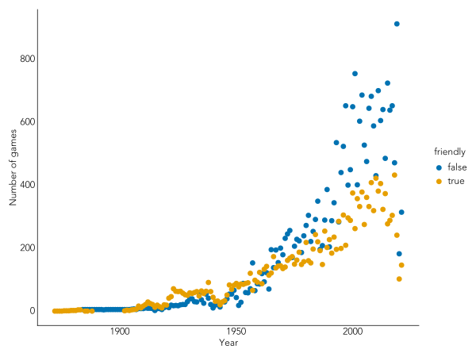
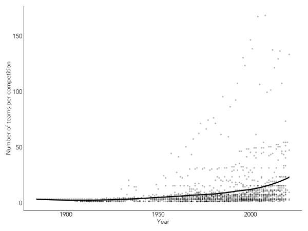
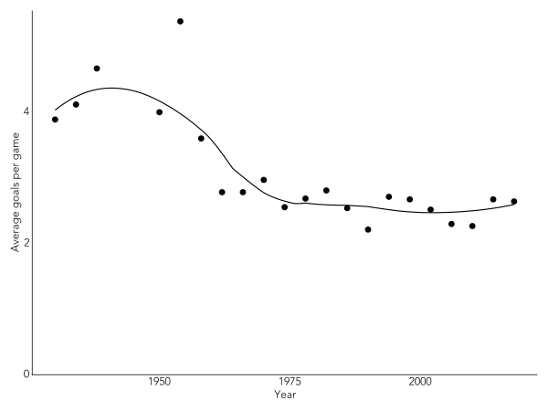
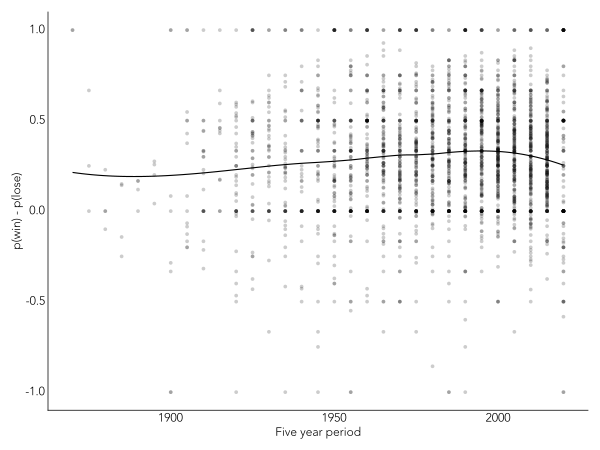

@def published = "2021-06-21 00:00:00 +0000"
@def title = "Analyzing international football results with Julia"
@def authors = "Julius Krumbiegel"
@def rss = "Analyzing international football results with Julia"
@def rss_pubdate = Date(2021, 06, 21)
@def rss_author = "Julius Krumbiegel"
@def tags = ["julia"]

# Analyzing international football results with Julia

As the UEFA Euro 202(0/1) is going on, I was inspired to check out a dataset of all international men's football matches since the dawn of time.
This post goes over some questions I had for the dataset, and how I approached the analysis with my recent macro package DataFrameMacros.jl.
Plotting is done with AlgebraOfGraphics.jl, which is a super useful grammar-of-graphics style package building on Makie.jl, which I'm a co-author of and which is therefore my preferred plotting package.

Let's set up some basics and import the necessary packages:

```julia
using CairoMakie
using AlgebraOfGraphics
using Chain
using CSV
using Downloads
using DataFrames
using DataFrameMacros
using StatsBase
using Dates

CairoMakie.activate!(type = "svg")
set_theme!(theme_minimal(), font = "Avenir Light")
```

First, we need to download the dataset, which is available on [github](https://raw.githubusercontent.com/martj42/international_results/master/results.csv).

```julia
url = "https://raw.githubusercontent.com/martj42/international_results/master/results.csv"

df = @chain url begin
    Downloads.download
    CSV.File(missingstring = "NA")
    DataFrame
end

first(df, 10)
```

~~~
<table class="data-frame"><thead><tr><th></th><th>date</th><th>home_team</th><th>away_team</th><th>home_score</th><th>away_score</th><th>tournament</th><th>city</th><th>country</th><th>neutral</th></tr><tr><th></th><th>Date</th><th>String</th><th>String</th><th>Int64?</th><th>Int64?</th><th>String</th><th>String?</th><th>String?</th><th>Bool?</th></tr></thead><tbody><p>10 rows × 9 columns</p><tr><th>1</th><td>1872-11-30</td><td>Scotland</td><td>England</td><td>0</td><td>0</td><td>Friendly</td><td>Glasgow</td><td>Scotland</td><td>0</td></tr><tr><th>2</th><td>1873-03-08</td><td>England</td><td>Scotland</td><td>4</td><td>2</td><td>Friendly</td><td>London</td><td>England</td><td>0</td></tr><tr><th>3</th><td>1874-03-07</td><td>Scotland</td><td>England</td><td>2</td><td>1</td><td>Friendly</td><td>Glasgow</td><td>Scotland</td><td>0</td></tr><tr><th>4</th><td>1875-03-06</td><td>England</td><td>Scotland</td><td>2</td><td>2</td><td>Friendly</td><td>London</td><td>England</td><td>0</td></tr><tr><th>5</th><td>1876-03-04</td><td>Scotland</td><td>England</td><td>3</td><td>0</td><td>Friendly</td><td>Glasgow</td><td>Scotland</td><td>0</td></tr><tr><th>6</th><td>1876-03-25</td><td>Scotland</td><td>Wales</td><td>4</td><td>0</td><td>Friendly</td><td>Glasgow</td><td>Scotland</td><td>0</td></tr><tr><th>7</th><td>1877-03-03</td><td>England</td><td>Scotland</td><td>1</td><td>3</td><td>Friendly</td><td>London</td><td>England</td><td>0</td></tr><tr><th>8</th><td>1877-03-05</td><td>Wales</td><td>Scotland</td><td>0</td><td>2</td><td>Friendly</td><td>Wrexham</td><td>Wales</td><td>0</td></tr><tr><th>9</th><td>1878-03-02</td><td>Scotland</td><td>England</td><td>7</td><td>2</td><td>Friendly</td><td>Glasgow</td><td>Scotland</td><td>0</td></tr><tr><th>10</th><td>1878-03-23</td><td>Scotland</td><td>Wales</td><td>9</td><td>0</td><td>Friendly</td><td>Glasgow</td><td>Scotland</td><td>0</td></tr></tbody></table>
~~~

Let's start with a simple question: How did the number of games played per year develop over time?
In DataFrameMacros.jl, you can group by columns that you create directly in the groupby call.

We can directly visualize the result by chaining the analysis into AlgebraOfGraphics.

```julia
@chain df begin
    @groupby(:year = year(:date))
    combine(nrow => :n_games)
    data(_) *
        mapping(:year => "Year", :n_games => "Number of games") *
        visual(Scatter)
    draw
end
```


There has been a huge growth in the number of games per year.
What could have been the driving factors there?
We could look at the development of friendly vs. non-friendly games.

As soon as there are some groups to plot separately, I like using AlgebraOfGraphics.jl, which does all the work of grouping and legend building for me.
I can build one long chain that culminates in a plot, so I don't have to come up with names for intermediary steps.

```julia
@chain df begin
    @groupby(:year = year(:date), :friendly = :tournament == "Friendly")
    combine(nrow => :n_games)
    data(_) *
        mapping(:year => "Year", :n_games => "Number of games",
            color = :friendly => nonnumeric) *
        visual(Scatter)
    draw
end
```


So we can see that both friendlies and competitions have become much more numerous, although the competitions are responsible for the larger share.

Another way we could look at this information is to count the number of different competitions per year:

```julia
@chain df begin
    @subset(:tournament != "Friendly")
    @groupby(:year = year(:date))
    @combine(:n_competitions = length(unique(:tournament)))
    data(_) *
        mapping(:year => "Year", :n_competitions => "Number of competitions") *
        (visual(Scatter, markersize = 5) + smooth())
    draw
end
```


And of course the average number of teams per competition:

```julia
@chain df begin
    @subset(:tournament != "Friendly")
    @groupby(:year = year(:date), :tournament)
    @combine(:n_teams = @c length(unique(vcat(:home_team, :away_team))))
    data(_) *
        mapping(:year => "Year", :n_teams => "Number of teams per competition") *
        (visual(Scatter, markersize = 4, color = (:black, 0.3)) + smooth() * visual(linewidth = 3))
    draw
end
```


So both the number of competitions, as well as the number of teams taking part in each competition has increased over the years.

Let's check out how the number of goals per game during world cups has developed over time.
As football has become more and more professionalized, do the highly trained players of today score more or fewer goals? (The defense is also better trained, of course.)

```julia
@chain df begin
    @subset(:tournament == "FIFA World Cup")
    @transform(:year = year(:date))
    @transform(:n_goals = :home_score + :away_score)
    @groupby(:year)
    @combine(:average_goals = mean(:n_goals))
    data(_) *
        mapping(:year => "Year", :average_goals => "Average goals per game") *
        (visual(Scatter) + smooth())
    draw(axis = (limits = (nothing, (0, nothing)),))
end
```


It seems the number of goals has gone down over time, from around 4 to 2.5 or so, where it has plateaued.
This dataset can give no indication, though, what the reasons for this development might be.

One thing we can look at, though, is the distribution of goal differences over time.
Maybe the teams were just much more different in ability before?

We could make histograms for 1954 and 1990, which had high and low averages, respectively.

```julia
@chain df begin
    @transform(:year = year(:date))
    @subset(:tournament == "FIFA World Cup", :year in (1954, 1990))
    @transform(:goal_difference = abs(:home_score - :away_score))
    data(_) *
        mapping(:goal_difference  => "Goal difference",
            col = :year => nonnumeric) *
        frequency()
    draw
end
```


So there were even games with 7 or 9 goals difference in 1954, suggesting that at least some of the matches might have been quite unbalanced at the time, driving a higher goal average.

In 1990, most games were decided by one goal difference, in comparison.

Let's turn to another question, that of the home team advantage.
For a quick glance, we can compute the probability of winning as the home team.

```julia
@chain df begin
    @subset(_, !:neutral; skipmissing = true)
    @transform(:home_result = @m :home_score > :away_score ?
        "win" : :away_score > :home_score ? "lose" : "tie")
    dropmissing(:home_result)
    @aside n = nrow(_)
    @groupby(:home_result)
    @combine(:p = length(:home_result) / n)
end
```

~~~
<table class="data-frame"><thead><tr><th></th><th>home_result</th><th>p</th></tr><tr><th></th><th>String</th><th>Float64</th></tr></thead><tbody><p>3 rows × 2 columns</p><tr><th>1</th><td>tie</td><td>0.231298</td></tr><tr><th>2</th><td>win</td><td>0.504721</td></tr><tr><th>3</th><td>lose</td><td>0.263982</td></tr></tbody></table>
~~~

It looks like the probability to win as the home team is about 50%, so twice as likely as losing.
This could be a bit misleading, potentially, if the better teams are also somehow the teams that host more games.

So we could check how it looks if we compute the win lose ratio for each team separately.
One problem is that each "team" (country) changes all the time, and Germany from 1950 has nothing in common with Germany from 2020.
As an approximation, we can split the timeline into 5 year bins, and calculate the ratio within those.

```julia
@chain df begin
    @subset(_, !:neutral; skipmissing = true)
    @transform(:home_result = @m :home_score > :away_score ?
        "win" : :away_score > :home_score ? "lose" : "tie")
    dropmissing(:home_result)
    @transform(:fiveyears = year(:date) - year(:date) % 5)
    stack([:home_team, :away_team], variable_name = :type,
        value_name = :team)
    @transform(:result = if :type == "home_team"
        :home_result
    else
        :home_result == "win" ? "lose" :
            :home_result == "lose" ? "win" : "tie"
    end)
    @subset(:result != "tie")
    @groupby(:fiveyears, :team, :type, :result)
    combine(nrow  => :count)
    unstack(:result, :count)
    @transform(:win = coalesce(:win, 0), :lose = coalesce(:lose, 0))
    @transform(:p_win = :win / (:win + :lose))
    unstack([:fiveyears, :team], :type, :p_win)
    @transform(:home_p_win_delta = :home_team - :away_team)
    dropmissing(:home_p_win_delta)
    data(_) *
        mapping(:fiveyears => "Five year period", :home_p_win_delta => "p(win) - p(lose)") *
        (visual(Scatter, markersize = 5, color = (:black, 0.2)) + smooth())
    draw
end
```


Even though this is only a pretty rough analysis, the home advantage appears to hold up when looking at it within each team, separately over time.

This was an example of data analysis and plotting with DataFrameMacros.jl and AlgebraOfGraphics.jl.
I hope you learned something new, either about Julia, or about international football.

